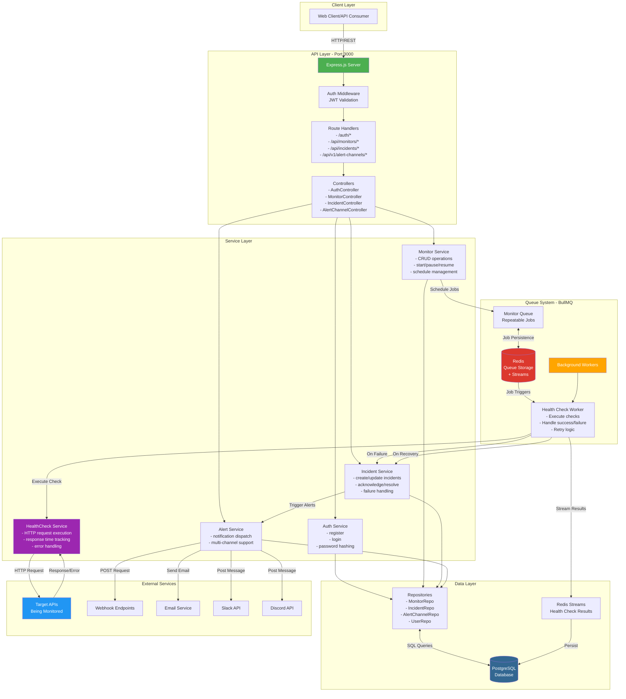
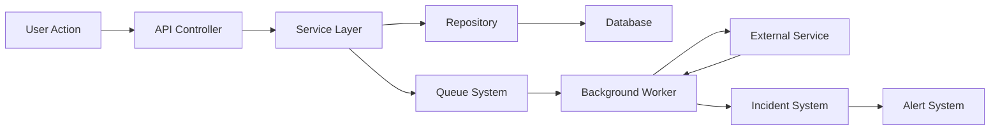
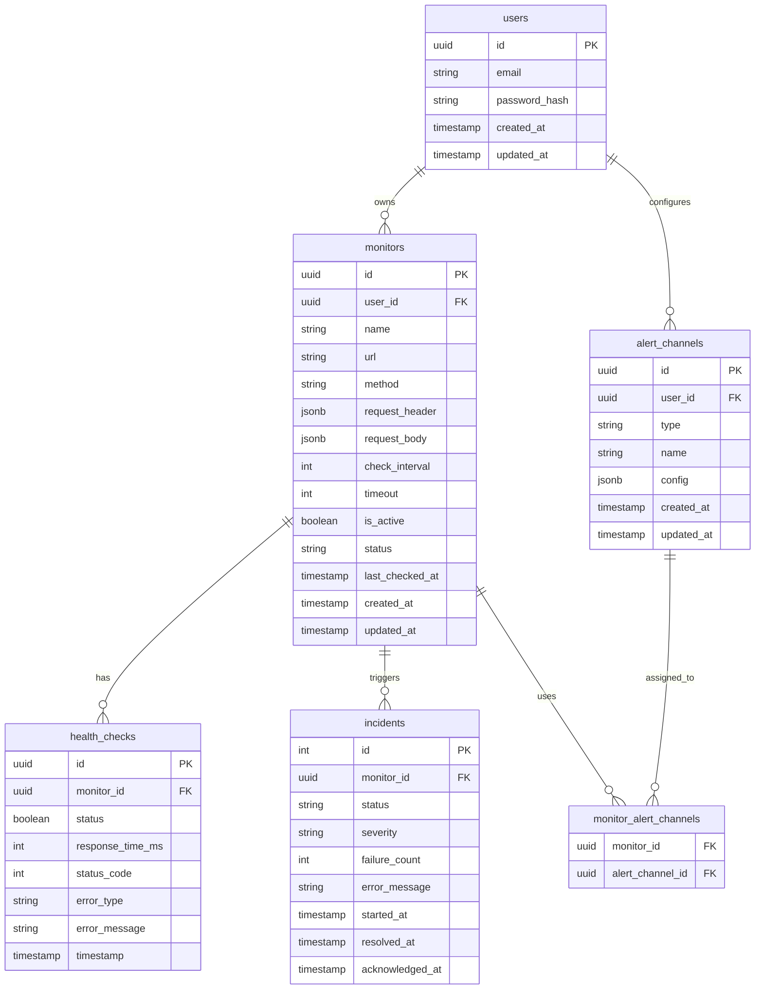
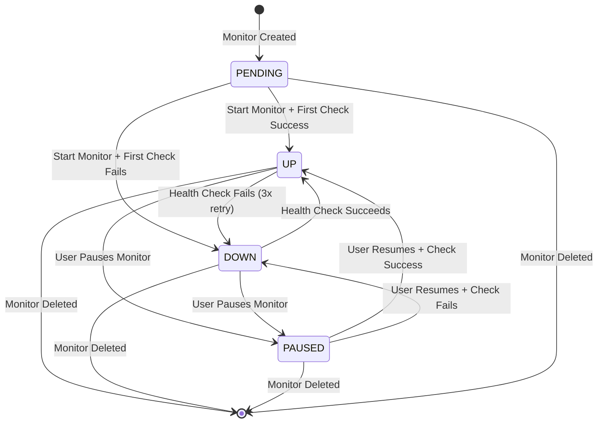
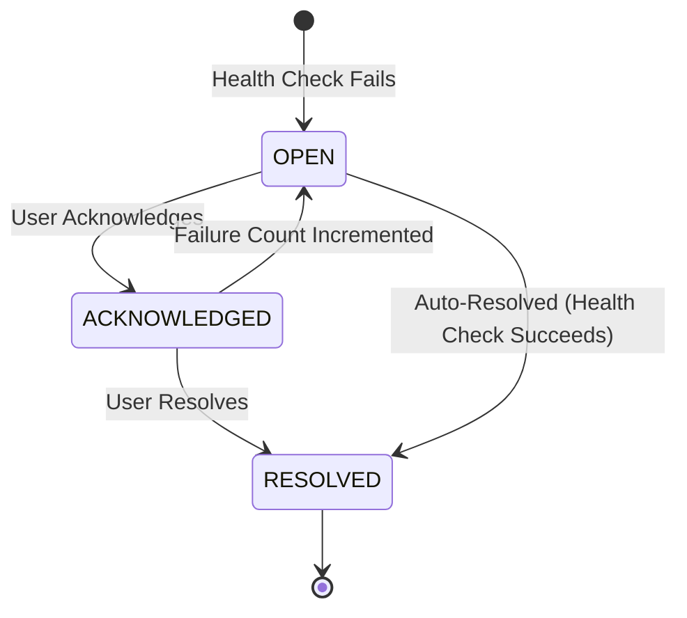
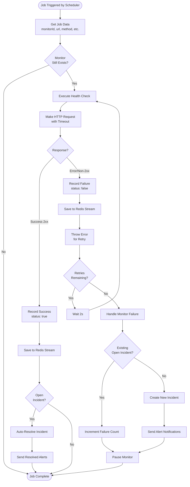
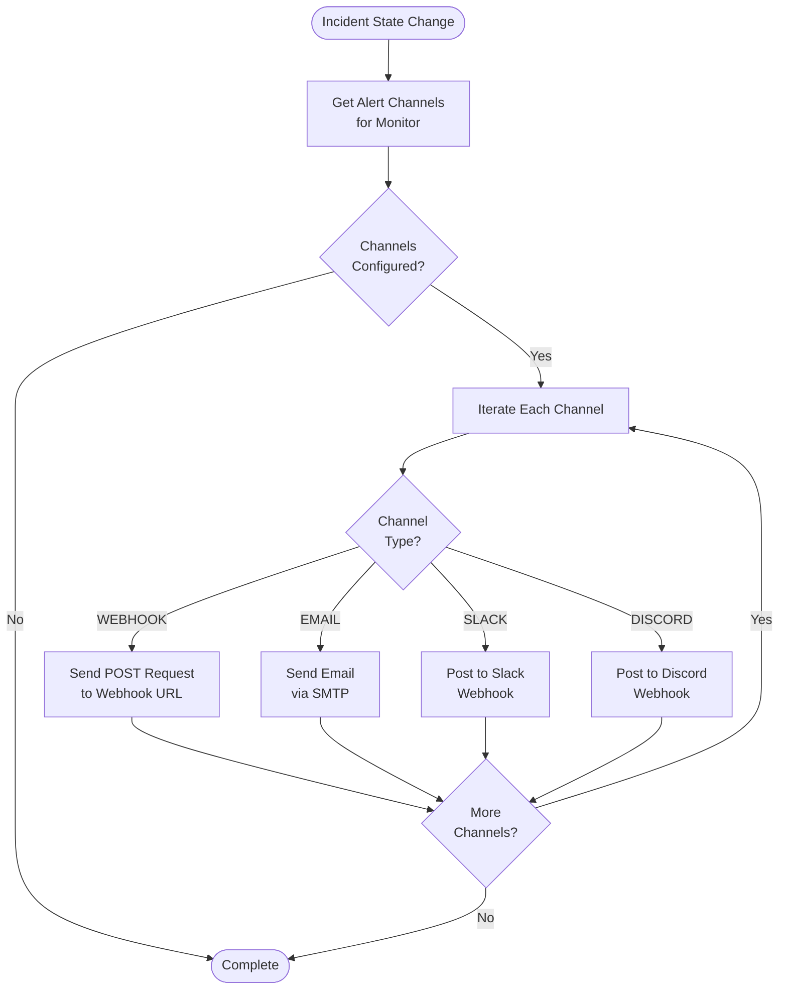
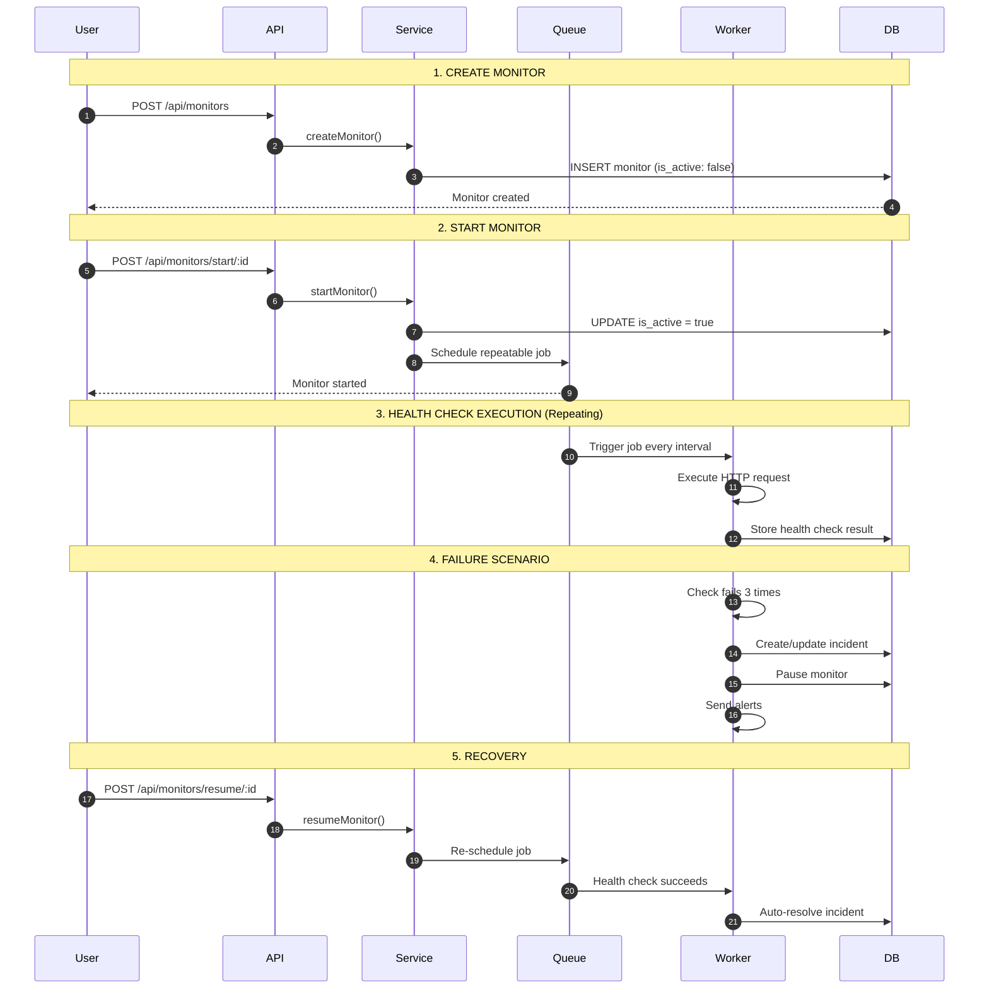
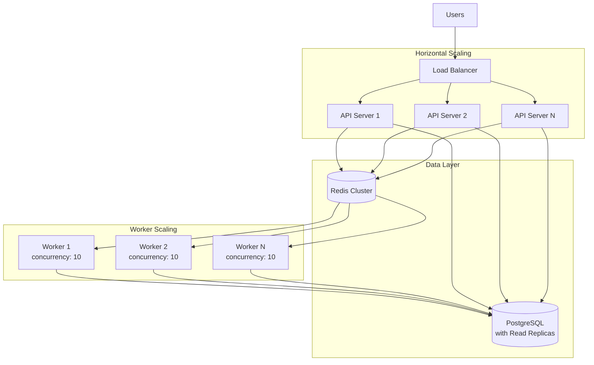

# API Monitor - Architecture Diagram

This document provides visual architecture diagrams for the API Monitor system.

## System Architecture Diagram

## Component Interaction Flow

## Database Schema Overview

## Monitor State Machine

## Incident State Machine

## Health Check Worker Flow

## Alert Notification Flow

## Data Flow: Monitor Lifecycle

## Technology Stack Details

| Layer | Technology | Purpose |
|-------|-----------|---------|
| **API Server** | Express.js + TypeScript | HTTP server and routing |
| **Authentication** | JWT (jsonwebtoken) | Stateless authentication |
| **Job Queue** | BullMQ | Reliable job scheduling and retry logic |
| **Cache & Streams** | Redis | Job storage, result streaming |
| **Database** | PostgreSQL | Persistent data storage |
| **HTTP Client** | Axios | Health check HTTP requests |
| **Validation** | Zod | Request schema validation |
| **ORM** | Direct SQL | Database queries |

## Scalability Considerations

### Scaling Strategies:

1. **API Server**: Stateless design allows horizontal scaling behind load balancer
2. **Workers**: Multiple workers can process jobs concurrently from Redis
3. **Database**: Read replicas for health check history queries
4. **Redis**: Cluster mode for high availability
5. **Job Concurrency**: Each worker processes 10 jobs simultaneously

---

**Last Updated**: February 4, 2026
