# API Monitor - Sequence Diagrams

This document provides detailed sequence diagrams for all major flows in the API Monitor application. The diagrams illustrate how different components interact to provide API monitoring, incident management, and alerting capabilities.

## Table of Contents
1. [User Authentication Flow](#1-user-authentication-flow)
2. [Monitor Creation Flow](#2-monitor-creation-flow)
3. [Monitor Lifecycle (Start/Pause/Resume)](#3-monitor-lifecycle-startpauseresume)
4. [Health Check Execution Flow](#4-health-check-execution-flow)
5. [Incident Creation & Management Flow](#5-incident-creation--management-flow)
6. [Alert Notification Flow](#6-alert-notification-flow)
7. [Monitor Update Flow](#7-monitor-update-flow)
8. [Get Monitor History Flow](#8-get-monitor-history-flow)

---

## 1. User Authentication Flow

### 1.1 Registration Flow

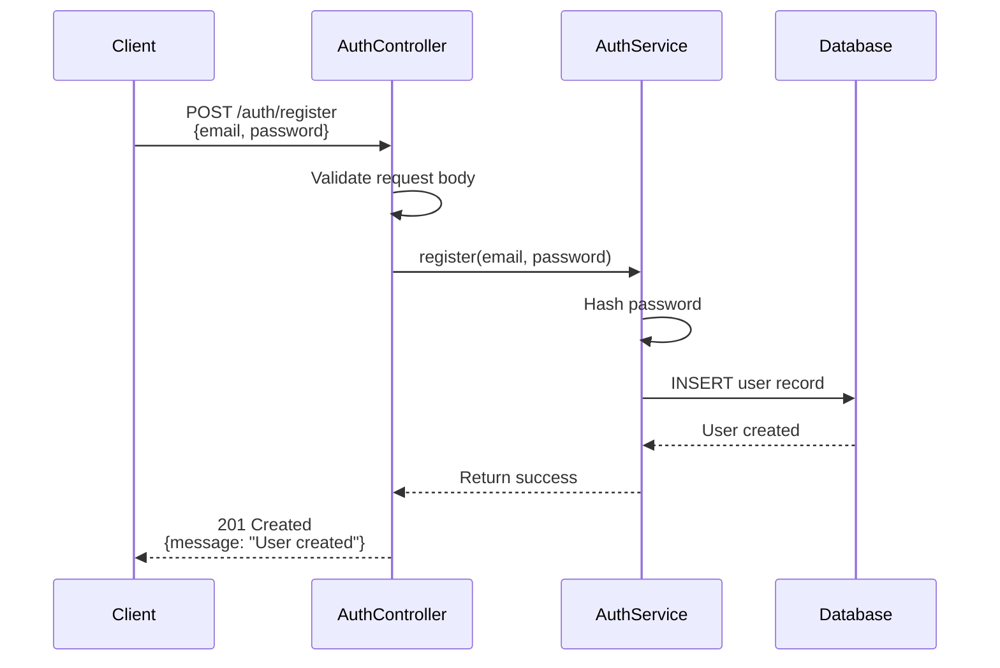

### 1.2 Login Flow

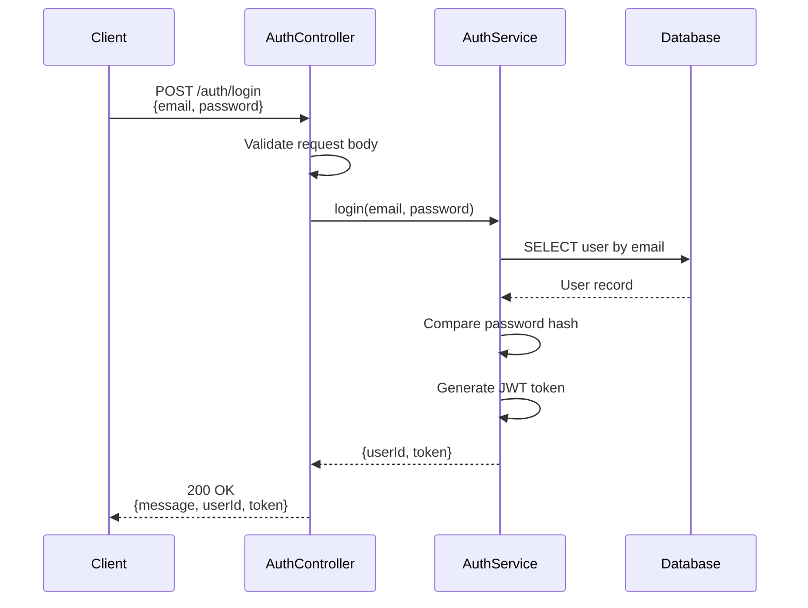

---

## 2. Monitor Creation Flow

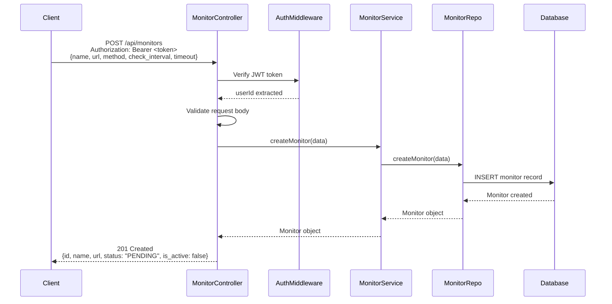

---

## 3. Monitor Lifecycle (Start/Pause/Resume)

### 3.1 Start Monitor Flow

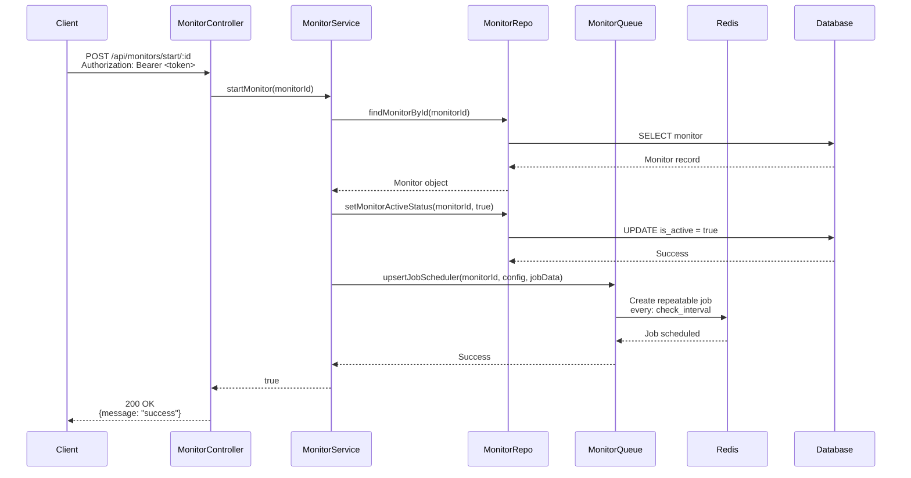

### 3.2 Pause Monitor Flow

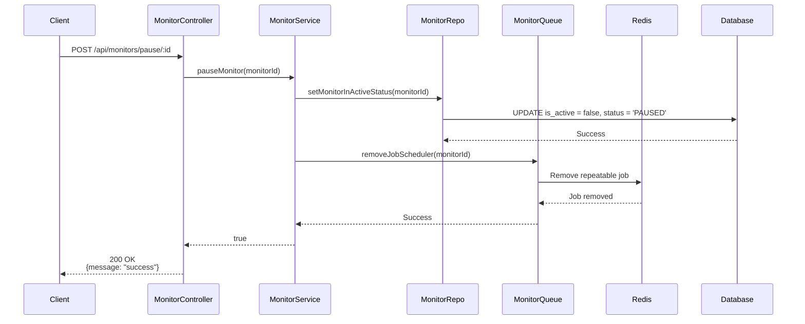

### 3.3 Resume Monitor Flow

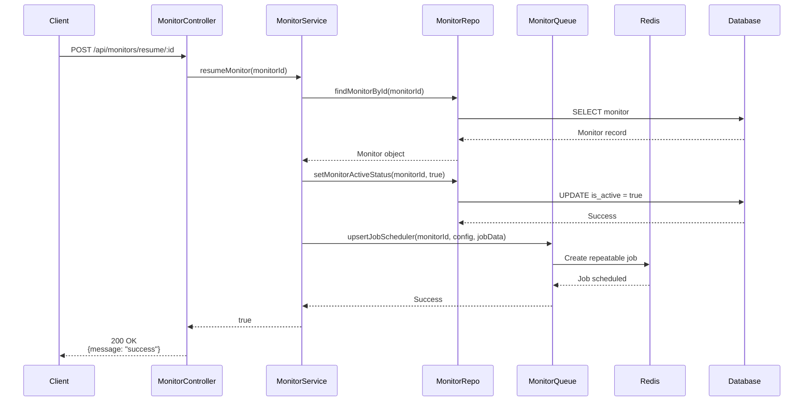

---

## 4. Health Check Execution Flow

This is the core monitoring flow that runs periodically for each active monitor.

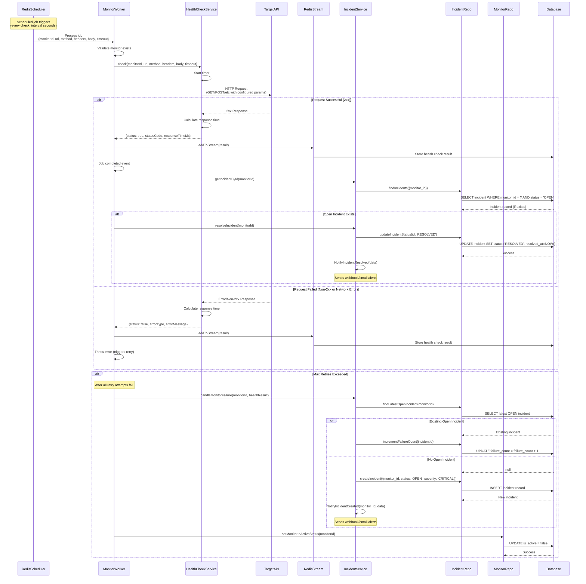

---

## 5. Incident Creation & Management Flow

### 5.1 Incident Creation (Automatic)

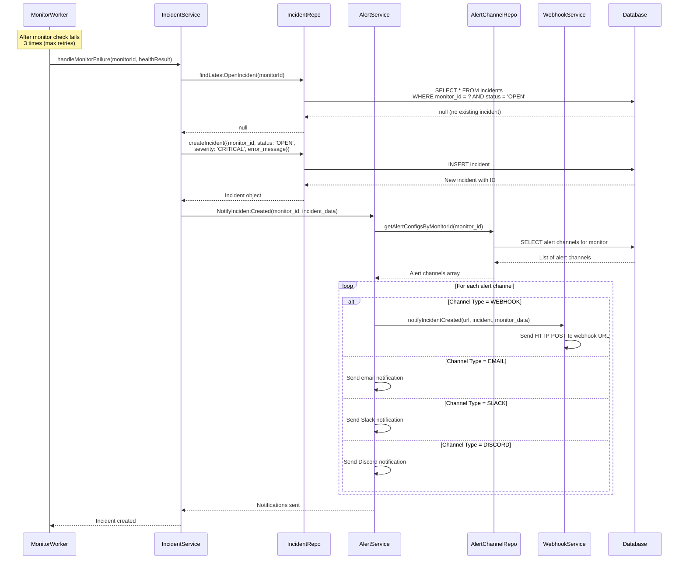

### 5.2 Acknowledge Incident Flow

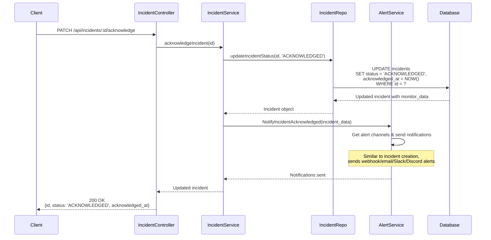

### 5.3 Resolve Incident Flow

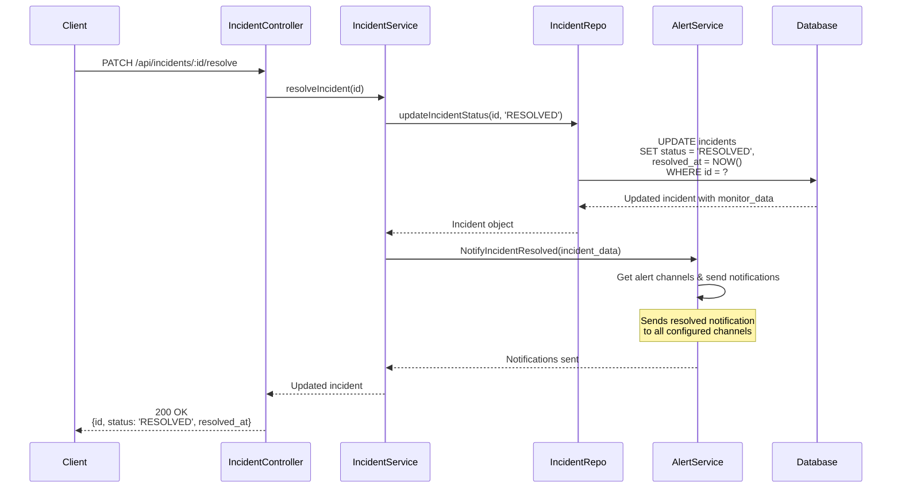

---

## 6. Alert Notification Flow

### 6.1 Create Alert Channel Flow

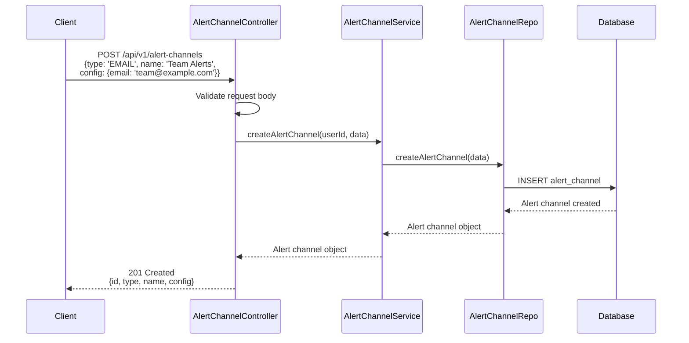

### 6.2 Test Alert Channel Flow

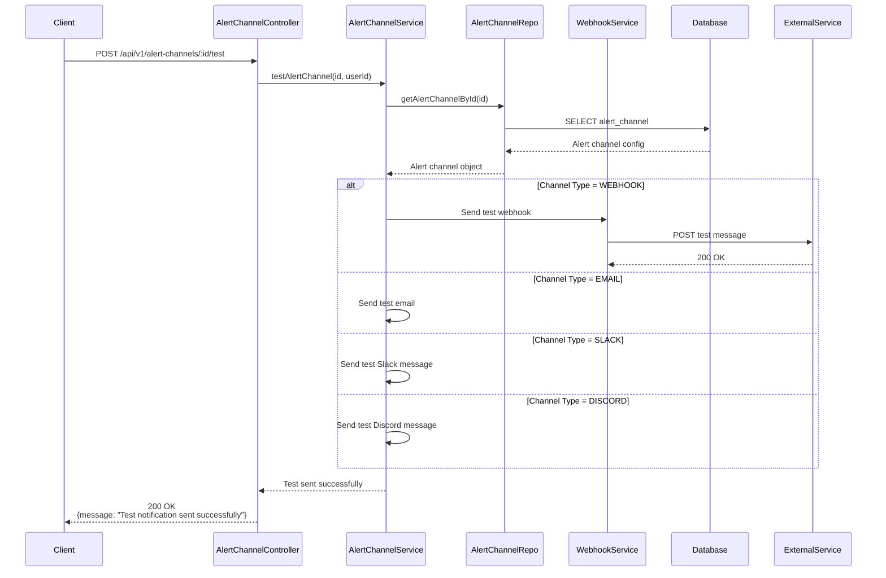

---

## 7. Monitor Update Flow

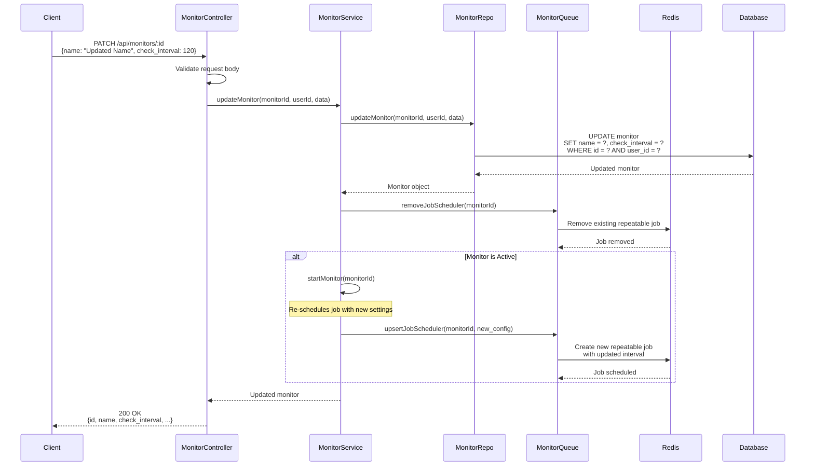

---

## 8. Get Monitor History Flow

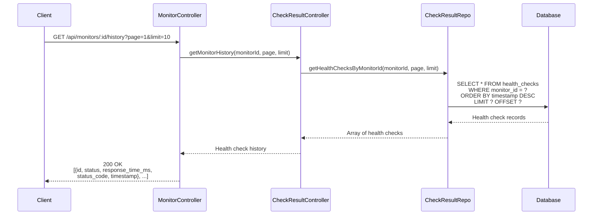

---

## System Architecture Overview

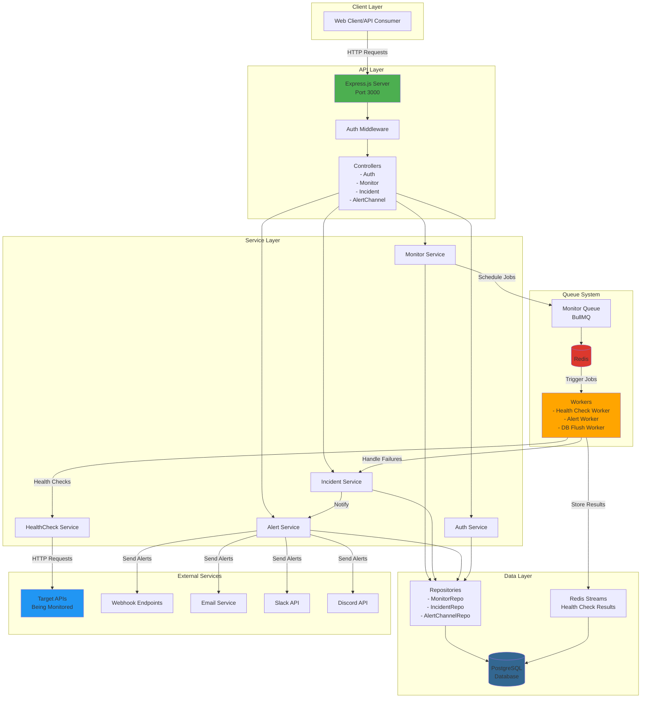

---

## Key Components Description

### 1. **Express Server (app.ts)**
- Main entry point for the API
- Handles routing and middleware
- Manages CORS and authentication

### 2. **Controllers**
- Handle HTTP requests and responses
- Validate input data
- Call appropriate services

### 3. **Services**
- Contain business logic
- Orchestrate between repositories and external services
- Handle complex workflows

### 4. **Repositories**
- Direct database access layer
- Execute SQL queries
- Return data objects

### 5. **Queue System (BullMQ + Redis)**
- Manages scheduled health checks
- Handles job retries with backoff
- Provides job persistence

### 6. **Workers**
- Process background jobs
- Execute health checks
- Handle success/failure scenarios
- Manage incidents

### 7. **Redis Streams**
- Store health check results
- Provide real-time data streaming
- Enable historical data analysis

### 8. **Alert System**
- Multi-channel notification support
- Webhook integration
- Email, Slack, Discord support

---

## Data Flow Summary

1. **Monitor Creation**: User creates a monitor via API → Stored in database with `is_active: false`

2. **Monitor Activation**: User starts monitor → Job scheduled in Redis → Worker picks up job periodically

3. **Health Check**: Worker executes HTTP request to target API → Result stored in Redis Stream → Synced to database

4. **Success Scenario**: If check succeeds and incident was open → Auto-resolve incident → Send resolution notification

5. **Failure Scenario**: If check fails after retries → Create/update incident → Pause monitor → Send alert notifications

6. **Alert Flow**: Incident state change → Alert service retrieves channels → Sends notifications via configured channels

---

## Notes

- **Authentication**: All protected endpoints require JWT token in Authorization header
- **Monitoring Interval**: Minimum 10 seconds between checks
- **Retry Policy**: 3 attempts with 2-second fixed backoff
- **Auto-Pause**: Monitors auto-pause after max retries to prevent alert spam
- **Incident Lifecycle**: OPEN → ACKNOWLEDGED → RESOLVED
- **Alert Channels**: EMAIL, WEBHOOK, SLACK, DISCORD

---

**Last Updated**: February 4, 2026
**Version**: 1.0
